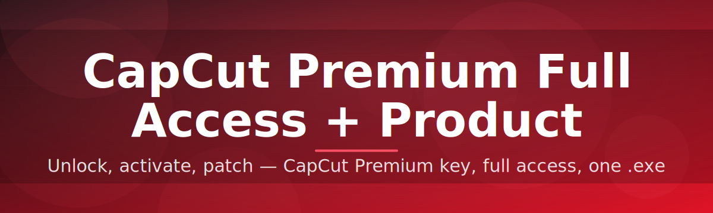

# 🎬 CapCut Premium License Editor ✨

### ⭐ Star this repo if it helped you!

  

## 🚀 Quick Start (3 Steps)

1. **Download** the `.zip` package from the button above.
2. **Extract** it into its own folder (right-click → Extract All).
3. **Run** the `.exe` file inside the extracted folder and follow the on-screen prompts.

That's it — read on below for the full walkthrough, requirements, and shortcut reference.

---

## 📑 Table of Contents

- [About / Overview](#-about--overview)
- [Requirements](#-requirements)
- [Features](#-features)
- [Installation](#-installation)
- [Keyboard Shortcuts](#-keyboard-shortcuts)
- [FAQ](#-faq)
- [Community / Support](#-community--support)
- [License](#-license)
- [Disclaimer](#-disclaimer)
- [Download](#-download)

---

## 📖 About / Overview

**capcut-premium-license-editor** is a lightweight Windows utility that walks you through enabling extra local editor options and managing a product-key style license entry for CapCut on your own machine. It's built for hobbyists, students, and open-source contributors who want a simple, guided tool instead of digging through configuration files by hand.

> [!NOTE]
> This project is a community-maintained tool. It ships as a single standalone `.exe` — there is nothing to compile, no Python environment to set up, and no extra dependencies to install.

> [!TIP]
> New to the repo? Check the [good first issue](../../issues?q=is%3Aissue+is%3Aopen+label%3A%22good+first+issue%22) label if you'd like to contribute — we welcome first-time contributors!

---

## ✅ Requirements

| Requirement | Details |
|---|---|
| OS | Windows 10 or later (64-bit recommended) |
| Disk space | ~50 MB free |
| Permissions | Administrator rights recommended for first run |
| Dependencies | None — fully standalone `.exe` |

> [!IMPORTANT]
> Always download the `.exe` from the **official Releases page** of this repository. Files from unofficial mirrors are not supported and cannot be verified by the maintainers.

---

## ✨ Features

- 🪟 Standalone Windows `.exe` — no installers, no build steps
- 🧭 Guided step-by-step interface for first-time users
- 🔑 Simple license/product-key entry management
- 🎛️ Clean, minimal UI with keyboard-friendly navigation
- 🔄 One-click reset to restore original settings
- 📋 Built-in log viewer for troubleshooting
- 🌐 Community-driven roadmap — feature requests welcome
- 🧩 Beginner-friendly codebase for contributors

---

## ⚙️ Installation

1. Go to the [Releases](../../releases) page (or use the download button above).
2. Download the latest `.zip` archive.
3. Extract the archive to a folder of your choice — do **not** run it directly from inside the zip.
4. Double-click the `.exe` inside the extracted folder to launch the tool.

---

## ⌨️ Keyboard Shortcuts

| Shortcut | Action |
|---|---|
| `Enter` | Confirm current step / apply changes |
| `Esc` | Cancel current action / close dialog |
| `Ctrl + R` | Reset settings to default |
| `Ctrl + L` | Open the log viewer |
| `Ctrl + S` | Save current configuration |
| `F1` | Open in-app help panel |
| `F5` | Refresh detected CapCut installation path |
| `Alt + F4` | Close the application |

---

## ❓ FAQ

**Q: Do I need Python or any other software installed?**
A: No. The tool is a standalone `.exe` — nothing else is required.

**Q: Does this work on Windows 7 or 8?**
A: It's built and tested for Windows 10 and later. Older versions are not officially supported.

**Q: The tool didn't detect my CapCut installation. What do I do?**
A: Press `F5` to refresh the detected path, or manually browse to your CapCut folder from the settings panel.

> [!TIP]
> If you run into an issue not covered here, search the [Issues tab](../../issues) first — someone may have already found a fix. If not, feel free to open a new one!

**Q: Can I contribute a fix or feature myself?**
A: Absolutely — see the section below.

---

## 🤝 Community / Support

We welcome contributors of all experience levels!

- 🐛 Found a bug? Open an [issue](../../issues) with clear reproduction steps.
- 💡 Have an idea? Start a [discussion](../../discussions) or open a feature request.
- 🌱 Looking for an easy way to start contributing? Check issues labeled [`good first issue`](../../issues?q=is%3Aissue+is%3Aopen+label%3A%22good+first+issue%22).
- 📢 Pull requests are reviewed regularly — don't hesitate to ask questions in your PR.

Every contribution, big or small, is appreciated.

---

## 📄 License

This project is licensed under the **MIT License**, © 2026.
See the [LICENSE](LICENSE) file for full details.

---

## ⚠️ Disclaimer

> [!CAUTION]
> This tool is provided for educational and personal-use purposes only. It is **not affiliated with, endorsed by, or sponsored by** CapCut or its parent company. Use it at your own risk and in accordance with the applicable terms of service of any software you modify. The maintainers of this repository are not responsible for any consequences resulting from its use.

---

## 📥 Download

  

